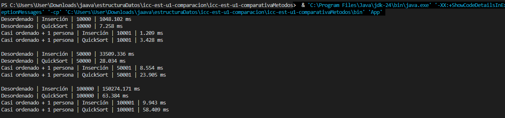

# Práctica de Ordenamiento de Personas
## Nicolás Aguilar icc

## Descripción

Se desarrolló una aplicación en Java para generar arreglos de objetos `Persona` y ordenarlos mediante dos algoritmos:

- Insertion Sort
- QuickSort

Cada persona tiene un nombre y una edad. El criterio de ordenamiento utiliza primero la edad y, si dos personas tienen la misma edad, se compara el valor numérico generado a partir del nombre.


## Estructura del proyecto

```text
src/
├── App.java
├── controllers/
│   └── SortPersonaMethods.java
├── models/
│   ├── Persona.java
│   └── Resultado.java
└── utils/
    └── Benchmarking.java
```


### Escenario 1: arreglo completamente desordenado

Se generó un arreglo de personas con edades aleatorias. Luego se crearon copias independientes para ordenar una con Inserción y otra con QuickSort.

### Escenario 2: arreglo ordenado más una nueva persona

Primero se ordenó el arreglo base. Después se agregó una nueva persona al final y se volvió a ordenar con ambos algoritmos.

---

# Resultados obtenidos

## Tabla 1. Escenario 1: arreglo completamente desordenado

| Tamaño de muestra | Tiempo Inserción | Tiempo QuickSort | Algoritmo más rápido | Observación                                         |
| ----------------: | ---------------: | ---------------: | -------------------- | -----------                                         |
|            10.000 |     1068.102 ms  |     10000 ms     | Quicksort            |Quicksort: el más rapido para ordenar completamente  |
|            50.000 |     33509.336 ms |     28.034 ms    | Quicksort            |Quicksort: el más rapido para ordenar completamente  |
|           100.000 |    150274.171 ms |     63.384 ms    | QuickSort            |Quicksort: el más rapido para ordenar completamente  |

## Tabla 2. Escenario 2: arreglo ordenado más una nueva persona

| Tamaño de muestra | Tiempo Inserción | Tiempo QuickSort | Algoritmo más rápido | Observación                                         |
| ----------------: | ---------------: | ---------------: | -------------------- | -----------                                         |
|            10.001 |     1.209 ms     |     3.428 ms     | Insercion            |Insercion: Para uno ordenado y ordenar un elemento   |
|            50.001 |     8.554 ms     |     23.905 ms    | Insercion            |Insercion: Para uno ordenado y ordenar un elemento   |
|           100.001 |     9.943 ms     |     58.409 ms    | Insercion            |Insercion: Para uno ordenado y ordenar un elemento   |

---

# Análisis

## ¿Qué algoritmo fue más rápido en el escenario desordenado?

En el escenario completamente desordenado, la forma más facil de ordenarla es con QuickSort

## ¿Qué algoritmo fue más rápido en el escenario casi ordenado?

En este escenario (donde se ordena casi todo el arreglo) y hay uno suelto, el más rapido es Insercion

## ¿El crecimiento del tamaño de muestra afectó por igual a los dos algoritmos?

Si, realmente aveces demoraba 7258 ms en 10000 y en 100000 64384 ms en QuickSort, lo cual es una gran diferencia, y ni se diga en insercion, ahi crecio brutalmente.

## ¿Por qué Inserción puede mejorar cuando el arreglo ya está casi ordenado?

Debido a que el elemento desordenado lo compara con los anteriores, y al estar ordenado y solo uno desordenado no tiene que hacer muchos movimientos.

## ¿Por qué QuickSort suele ser mejor cuando los datos están muy desordenados?

Porque este no revisa elementos atras, este lo que hace es dividir y ordenar por partes, resolviendo el problema en sub arreglos

---

# Conclusiones

1. Puedo concluir que en un caso que el arreglo esta completamente desordenado, QuickSort es el más eficiente; acaba el problema más rapido.

2. En el caso de un arreglo casi ordenado, Insertion es el más rapido ya que este compara con los de atras y al ser un algoritmo no tan complejo acaba la tarea antes.

3. En un ambito laboral se me ocurre que Insertion nos sirve si agregamos algo a una lista por ejemplo un estudiante nuevo y lo queremos ordenar alfabeticamente. Por otro lado QuickSort cuando nos dan la lista ya completamente desordenada, o sea desde 0.

---

# Evidencia de ejecución

Colocar aquí una captura de pantalla de la consola con los tiempos obtenidos.



---
https://github.com/NicolasAguilar-prog/icc-est-u1-comparativaMetodos.git
